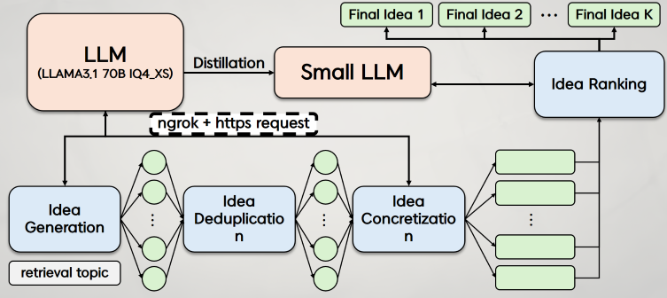

# yaicon-our-topic-is-blank


<h1 align="center">
  <b>Our topic is blank</b><br>
  <b>by YAICON 5th (이전)논문을 이븐하게 읽지 않았어요. </b><br>
</h1>

<p align="center">
 
</p>


This repository implements a research topic generation framework designed for YAICON, a conference organized by [YAI](<https://github.com/yonsei-YAI>) at Yonsei University. The framework was developed to help generate high-quality research topics across various AI subfields, supporting students in ideating innovative and impactful research ideas. 

It builds upon the baseline work found in [this repository](<https://github.com/NoviScl/AI-Researcher/tree/main>), which provides the foundation for generating novel research ideas using AI.

The system accepts a research domain or theme described in natural language as input and outputs a ranked list of potential project proposals. Each proposal provides a detailed research topic, enabling students to select a direction for their project with minimal additional effort.


<p align="center">
 
</p>

Our agent pipeline consists of the following modules:
(1) Related Paper Retrieval;
(2) Idea Generation;
(3) Idea Deduplication;
(4) Idea Conceretization;
(5) Idea Ranking;

These modules are designed to be run sequentially as an end-to-end idea generation pipeline. 

## Table of Contents

1. [Setup](#setup)
2. [Related Paper Retrieval](#related-paper-search)
3. [Idea Generation](#grounded-idea-generation)
4. [Idea Deduplication](#idea-deduplication)
5. [Idea Conceretization](#project-proposal-generation)
6. [Idea Ranking](#project-proposal-ranking)
7. [End-to-End Pipeline](#end-to-end-pipeline)


<p align="center">
 
</p>

## Setup

You can set up the environment by running the following commands:

```bash
git clone https://github.com/NoviScl/AI-Researcher.git
cd AI-Researcher
conda create -n ai-researcher python=3.10
conda activate ai-researcher
pip install -r requirements.txt
```

Create `keys.json` and store it in the project directory. The file should look like this:

```
{
    "api_key": "Your OpenAI API Key",
    "organization_id": "Your OpenAI Organization ID (Optional)",
    "s2_key": "Your Semantic Scholar API Key (Optional)",
    "anthropic_key": "Your Anthropic API Key"
}
```

## Related Paper Retrieval;


The related work search module will iteratively propose search queries and search through the Semantic Scholar API. We then use an LLM to score the relevance of retrieved papers for reranking. The module takes a topic description or an idea as input and returns a list of the most relevant papers as output.

Example usage (finding related papers for a given topic):
```
cd ai_researcher 
bash scripts/lit_review.sh 
```

The `max_paper_bank_size` is a hyperparameter to control when to stop the paper search process (until the specified number of papers has been retrieved). The generated search queries as well as the ranked papers will be stored in the specified cache file. The cache file can be used as part of the input to the idea generation module. We used `max_paper_bank_size=120` for the experiments in our paper and used `max_paper_bank_size=50` in this demo example. Running this demo example costs $0.51. 


## Idea Generation;


The idea generation module takes a topic description and optionally a list of relevant papers as input, and returns a list of generated ideas as the output. 

Example usage: 
```
cd ai_researcher 
bash scripts/grounded_idea_gen.sh
```

Due to the max output length constraint, we recommend generating ideas in batches of 5 (`ideas_n=5`) and running the script multiple times with different seeds to collect a larger set of ideas. You can set `RAG` to either `True` or `False` to turn on or off retrieval augmentation where we ground the idea generation on retrieved papers. We generated 4K ideas for each topic in our paper. In the demo example, we only generate 20 seed ideas, which costs $0.85.

## Idea Deduplication

We do a round of deduplication to remove similar ideas generated by the grounded idea generation module. We set a threshold of `similarity_threshold=0.8` cosine similarity based on the sentence embeddings to determine if two ideas are similar. The embedding is from the `sentence-transformers` library so this step doesn't cost any API credits to run.

Example usage:
```
cd ai_researcher
bash scripts/idea_dedup.sh
```

##  Idea Conceretization


Next, we expand each seed idea into a detailed project proposal. 

Example usage:
```
cd ai_researcher
bash scripts/project_proposal_gen.sh
```

Since the project proposals are long, each generation takes an average of $0.3 and running the whole demo example here takes $2.9.

## Idea Ranking

We rank all the generated project proposals by using an LLM ranker. 

Example usage:
```
cd ai_researcher
bash scripts/project_proposal_ranking.sh
```

The output will be a json file storing the score of each project proposal, which you can use to rank the proposals. The demo example costs $0.74 to rank 10 project proposals for 5 rounds of scoring.


## End-to-End Pipeline

We also provide a script that runs the entire pipeline to generate the project proposals based on the given research topic.

Example usage:
```
cd ai_researcher
bash scripts/end_to_end.sh
```
We are not releasing the full set of AI-generated project proposals since we are using them in the next phase of our study and we want to avoid any potential bias. However, you should be able to reproduce ideas with similar quality by following the steps above with an increased inference budget. 
